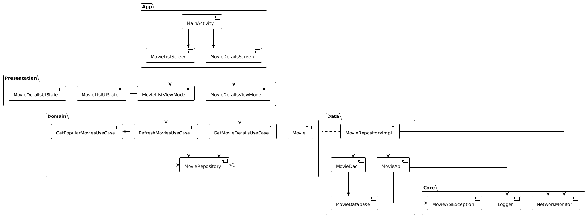

# Movie App

A modern Android application for browsing popular movies using the TMDB API. Built with Clean Architecture principles and modern Android development practices.

## Features

- Browse popular movies with infinite scrolling
- Pull-to-refresh functionality
- Offline support with caching
- Network state monitoring
- Error handling and retry mechanisms
- Modern Material 3 UI

## Architecture

The app follows Clean Architecture principles with the following layers:

### Presentation Layer
- UI components (Compose screens)
- ViewModels
- UI State management
- User interactions

### Domain Layer
- Use Cases
- Repository interfaces
- Domain models
- Business logic

### Data Layer
- Repository implementations
- API client
- Local database
- Data mappers

### Core Layer
- Network monitoring
- Logging
- Error handling
- Common utilities

## Architecture Diagram



## Data Flow

The application follows a unidirectional data flow pattern:


## Testing

The application has comprehensive test coverage across all layers:


## Getting Started

1. Clone the repository
2. Open the project in Android Studio
3. Build and run the app via the Android Studio terminal

### To build the app:
```shell
./gradlew clean assembleDebug
```

### To run the app:
First, start an emulator (API Level 29+ preferred), then run the following command:
```shell
./gradlew installDebug
```

### To generate test coverage reports:

#### Step 1: Run Tests
First, run all tests to generate the execution data:
```shell
./gradlew testDebugUnitTest
```

#### Step 2: Generate Individual Module Reports
After running the tests, each module will automatically generate its test coverage report. The reports can be found at:
- App Module: `app/build/reports/jacoco/appTestReport/html/index.html`
- Data Module: `data/build/reports/jacoco/dataTestReport/html/index.html`
- Domain Module: `domain/build/reports/jacoco/domainTestReport/html/index.html`
- Presentation Module: `presentation/build/reports/jacoco/presentationTestReport/html/index.html`
- Core Module: `core/build/reports/jacoco/coreTestReport/html/index.html`

#### Step 3: Generate Consolidated Report
To generate a consolidated report that combines coverage from all modules:
```shell
    ./gradlew jacocoFullReport
```

#### Alternatively, just run:
```shell
./gradlew clean test jacocoFullReport
```

The consolidated report will be available at:
`build/reports/jacoco/jacocoFullReport/html/index.html`

#### Step 4: Verify Coverage
To verify that the overall coverage meets the minimum requirements (70% overall, 80% per class):
```shell
./gradlew verifyCoverage
```

Note: The reports are generated in both HTML and XML formats. The XML reports are useful for CI/CD integration.

Important: Make sure to run the tests first (Step 1) before attempting to generate the reports. The reports will be skipped if the test execution data is not available.

## Dependencies

- Kotlin Coroutines
- Jetpack Compose
- Room Database
- Ktor
- Material 3
- Coil
- Koin
- MockK (for testing)
